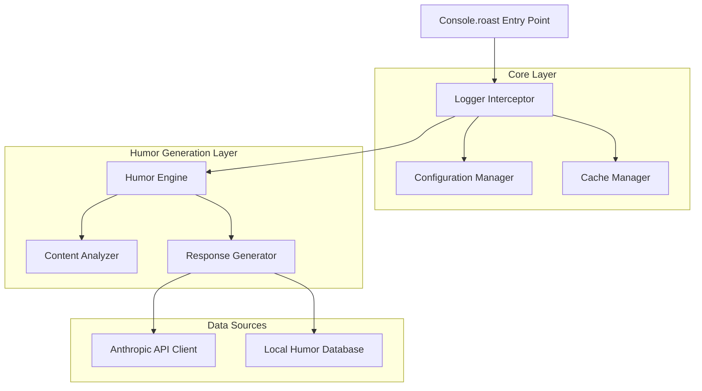

# Design Document

## Overview

Console.roast is designed as a lightweight Node.js library that enhances console.log with humorous commentary. The architecture follows a modular approach with clear separation between core logging functionality, humor generation, API integration, and configuration management. The system is designed to be non-intrusive, performant, and easily configurable.

## Architecture

The library follows a layered architecture:



## Components and Interfaces

### 1. Logger Interceptor
**Purpose**: Intercepts and enhances console.log calls
**Key Methods**:
- `intercept()`: Overrides native console.log
- `restore()`: Restores original console.log
- `enhancedLog(message, ...args)`: Processes and displays enhanced logs

### 2. Configuration Manager
**Purpose**: Handles library configuration and settings
**Configuration Options**:
```typescript
interface ConsoleRoastConfig {
  apiKey?: string;
  humorLevel: 'mild' | 'medium' | 'savage';
  frequency: number; // 0-100, percentage of logs to enhance
  enabled: boolean;
  cacheSize: number;
  apiTimeout: number;
  fallbackToLocal: boolean;
}
```

### 3. Content Analyzer
**Purpose**: Analyzes logged content to determine context for humor generation
**Analysis Categories**:
- Data types (string, number, object, array, boolean, null, undefined)
- Error patterns (stack traces, error objects)
- Common developer patterns (API responses, database queries, debug statements)
- Content sentiment and complexity

### 4. Humor Engine
**Purpose**: Orchestrates humor generation based on content analysis
**Key Methods**:
- `generateHumor(content, context)`: Main humor generation method
- `selectHumorType(analysis)`: Determines appropriate humor style
- `formatResponse(humor, original)`: Combines original message with humor

### 5. Anthropic API Client
**Purpose**: Handles communication with Anthropic's API for dynamic humor generation
**Features**:
- Rate limiting and retry logic
- Request sanitization (removes sensitive data)
- Response validation and formatting
- Graceful error handling with fallbacks

**API Integration Strategy**:
- Use Claude-3-haiku for fast, cost-effective responses
- Implement prompt engineering for consistent humor style
- Cache responses based on content similarity
- Implement circuit breaker pattern for API failures

### 6. Local Humor Database
**Purpose**: Provides fallback humor when API is unavailable
**Structure**:
```typescript
interface HumorEntry {
  triggers: string[]; // Content patterns that trigger this humor
  responses: string[]; // Array of possible responses
  humorLevel: 'mild' | 'medium' | 'savage';
  category: 'error' | 'success' | 'data' | 'general';
}
```

### 7. Cache Manager
**Purpose**: Manages response caching to improve performance
**Features**:
- LRU cache implementation
- Content-based cache keys
- Configurable cache size and TTL
- Memory usage monitoring

## Data Models

### LogEntry
```typescript
interface LogEntry {
  timestamp: Date;
  originalArgs: any[];
  processedContent: string;
  contentAnalysis: ContentAnalysis;
  humorResponse?: string;
  source: 'api' | 'local' | 'cache';
}
```

### ContentAnalysis
```typescript
interface ContentAnalysis {
  dataTypes: string[];
  complexity: 'simple' | 'medium' | 'complex';
  isError: boolean;
  sentiment: 'positive' | 'neutral' | 'negative';
  patterns: string[];
  sanitizedContent: string;
}
```

### HumorResponse
```typescript
interface HumorResponse {
  text: string;
  confidence: number;
  source: 'api' | 'local';
  cached: boolean;
}
```

## Error Handling

### API Failures
- **Circuit Breaker**: Temporarily disable API calls after consecutive failures
- **Graceful Degradation**: Fall back to local humor database
- **Retry Logic**: Exponential backoff for transient failures
- **Timeout Handling**: Configurable timeouts with fallback

### Content Sanitization
- **Sensitive Data Detection**: Remove API keys, passwords, tokens
- **PII Filtering**: Detect and mask personally identifiable information
- **Size Limits**: Truncate overly large content before API calls

### Performance Safeguards
- **Memory Limits**: Prevent cache from growing unbounded
- **Rate Limiting**: Respect API rate limits and implement client-side throttling
- **Async Processing**: Non-blocking humor generation when possible

## Testing Strategy

### Unit Testing
- **Component Isolation**: Test each component independently
- **Mock Dependencies**: Mock API calls and external dependencies
- **Edge Cases**: Test with various data types and edge cases
- **Configuration Testing**: Verify all configuration options work correctly

### Integration Testing
- **API Integration**: Test actual API calls with test credentials
- **End-to-End Flows**: Test complete logging enhancement flow
- **Performance Testing**: Measure latency impact and memory usage
- **Fallback Testing**: Verify graceful degradation scenarios

### Test Categories
```typescript
// Example test structure
describe('Console.roast', () => {
  describe('Logger Interceptor', () => {
    it('should intercept console.log calls');
    it('should maintain original functionality');
    it('should handle multiple arguments');
  });
  
  describe('Humor Engine', () => {
    it('should generate appropriate humor for different content types');
    it('should respect humor level configuration');
    it('should handle API failures gracefully');
  });
  
  describe('Anthropic Integration', () => {
    it('should authenticate successfully');
    it('should handle rate limits');
    it('should sanitize sensitive content');
  });
});
```

### Performance Benchmarks
- **Latency Impact**: < 10ms additional latency per log
- **Memory Usage**: < 50MB total memory footprint
- **API Response Time**: < 500ms for humor generation
- **Cache Hit Rate**: > 70% for repeated similar content

## Implementation Considerations

### TypeScript Support
- Full type definitions for all public APIs
- Generic types for flexible usage
- Strict type checking for configuration options

### Browser Compatibility
- Initially Node.js focused
- Future browser support through webpack/rollup builds
- Environment detection for appropriate fallbacks

### Extensibility
- Plugin architecture for custom humor sources
- Configurable content analyzers
- Custom humor databases

### Security
- API key management and validation
- Content sanitization before external API calls
- No logging of sensitive configuration data
- Secure defaults for all configuration options